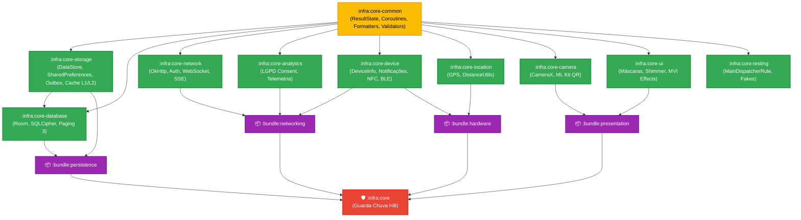

# 🏛️ Arquitetura e Diretrizes Técnicas — CoreAndroidNative

O **CoreAndroidNative** é a fundação de plataforma compartilhada para aplicações corporativas nativas em Android. Este documento detalha as decisões arquiteturais, o modelo de isolamento por camadas, os padrões de resiliência e as restrições invioláveis de engenharia.

---

## 🧭 Princípios Norteadores

1. **Zero UI nas Camadas Base:**
   - Módulos de regras de negócio (`:infra:core-common`), armazenamento (`:infra:core-storage`), banco de dados (`:infra:core-database`), rede (`:infra:core-network`) e sistema (`:infra:core-device`) **NÃO** dependem de Jetpack Compose nem de frameworks de interface.
   - Apenas `:infra:core-ui` e `:infra:core-camera` contêm dependências visuais.
2. **Abstração Baseada em Contratos:**
   - Todo componente reutilizável expõe uma `interface` pública (ex: `KeyValueDataStore`, `NetworkMonitor`, `TokenProvider`, `LocationClient`) antes da sua implementação concreta, facilitando a substituição em testes com fakes determinísticos.
3. **Distribuição em Dois Níveis:**
   - **Módulos Atômicos (`:infra:core-*`):** Para squads que priorizam arquiteturas estritas e tempos mínimos de compilação.
   - **Bundles Agregadores (`:bundle:*`):** Soluções temáticas pré-empacotadas (`persistence`, `networking`, `presentation`, `hardware`) que reduzem o boilerplate nos `build.gradle.kts`.
   - **Módulo Guarda-Chuva (`:infra:core`):** Ponto único de entrada com injeção de dependências global via Hilt (`@InstallIn(SingletonComponent::class)`).
4. **Inicialização Transparente:**
   - Inicializações essenciais (como `StrictModeHelper` em builds de debug) utilizam o **Jetpack App Startup**, eliminando a necessidade de acoplar lógica manual no `Application.onCreate()` dos apps consumidores.

---

## 🗺️ Mapa de Camadas e Dependências

---

## 🔒 Segurança em Repouso e em Trânsito

- **Persistência Criptografada:**
  - Valores de preferências confidenciais utilizam `EncryptedSharedPreferencesCore` apoiado pelo **Android KeyStore** com chaves AES-256 GCM e esquemas SIV.
  - O banco de dados SQLite local utiliza criptografia transparente de 256 bits com **SQLCipher** via `DatabaseEncrypter`.
- **Tráfego Seguro e Antifraude:**
  - `AuthInterceptor` e `TokenAuthenticator` garantem renovação segura de tokens JWT com trava atômica `Mutex`.
  - `SslPinningHelper` previne ataques Man-In-The-Middle (MITM) validando hashes SPKI SHA-256.
  - Sanitização preventiva de PII em logs e telemetria (`CoreLogger` mascara CPFs, cartões e tokens).

---

## ⚡ Estratégias de Concorrência & Offline-First

- **Concorrência Segura:**
  - Toda operação assíncrona é ancorada em despachantes explícitos via `CoroutineDispatchers` injetável (`main`, `io`, `default`, `unconfined`).
- **Offline Sync & Outbox Pattern:**
  - Durante instabilidade de conexão, requisições mutativas de rede são enfileiradas na `OutboxQueue` (persistente em disco e thread-safe).
  - O `SyncManager` despacha o processamento via `WorkManager` respeitando restrições de bateria e rede ativa.
- **Dois Níveis de Cache (L1 + L2):**
  - O `TwoLevelCache` provê velocidade instantânea de leitura em memória RAM (`LruCache`) combinada com persistência em disco com política de expiração por TTL (*Time-to-Live*).

---

## 🎯 Governança & Portões de Qualidade (Quality Gates)

Todas as contribuições e pull requests são submetidos a verificações estritas:

| Ferramenta / Job | Critério de Aceite |
| :--- | :--- |
| **Spotless (ktlint)** | 0 violações de formatação de código. |
| **Detekt** | 0 *code smells* ou violações de complexidade ciclomática. |
| **Binary Compatibility (BCV)** | Nenhuma alteração não intencional em APIs públicas (validação com `apiCheck`). |
| **Testes Unitários** | 100% de sucesso nas suítes JVM locais com Robolectric e Turbine. |
| **Jacoco** | Relatório de cobertura consolidado gerado via task agregadora `jacocoRootReport`. |
