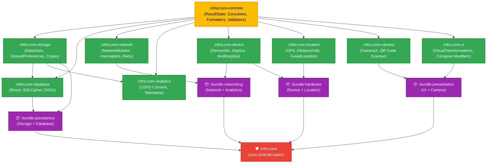

# CoreAndroidNative 🚀

[](https://github.com/Gabriel-do-Carmo-97/CoreAndroidNative/actions)
[](https://gabriel-do-carmo-97.github.io/CoreAndroidNative/)


**CoreAndroidNative** é uma biblioteca de infraestrutura corporativa nativa para Android, construída em Kotlin sob os mais altos padrões de engenharia de software móvel, Clean Architecture e Platform Engineering.

Projetada especificamente para suportar múltiplos aplicativos comerciais em escala, a biblioteca é dividida em **submódulos atômicos desacoplados** e **bundles temáticos de distribuição**, garantindo que camadas de domínio e dados permaneçam totalmente isoladas de dependências de interface de usuário (**zero Jetpack Compose nas camadas base**).

---

## 🏛️ Arquitetura Multi-Módulo e Bundles



---

## 📦 Catálogo de Módulos

### 1. Bundles de Distribuição (Recomendado para Produtividade)
Empacotam soluções temáticas completas prontas para consumo:

| Artefato | Namespace | Descrição |
| :--- | :--- | :--- |
| **`bundle-persistence`** | `br.com.wgc.bundle.persistence` | Solução completa de persistência: **`core-storage`** + **`core-database`** (Room criptografado, DataStore e SharedPreferences). |
| **`bundle-networking`** | `br.com.wgc.bundle.networking` | Stack de comunicação: **`core-network`** + **`core-analytics`** + **`core-device`** (Conectividade, Telemetria e LGPD). |
| **`bundle-presentation`** | `br.com.wgc.bundle.presentation` | Camada visual: **`core-ui`** + **`core-camera`** (Compose Masks, Modifiers e CameraX Preview). |
| **`bundle-hardware`** | `br.com.wgc.bundle.hardware` | Integrações físicas: **`core-device`** + **`core-location`** (GPS, Notificações e Haptics). |

### 2. Módulos de Infraestrutura Atômica (Importação Granular)
Para arquiteturas limpas onde cada camada importa apenas o que precisa:

| Artefato | Namespace | Compose? | Descrição |
| :--- | :--- | :---: | :--- |
| **`core-common`** | `br.com.wgc.core.common` | ❌ **NÃO** | `ResultState`, `CoroutineDispatchers`, `retryWithBackoff`, `CoreLogger` (PII Masking), `Validators` (CPF, CNPJ, Email, Telefone, CEP), `Formatters`. |
| **`core-storage`** | `br.com.wgc.core.storage` | ❌ **NÃO** | `KeyValueDataStore`, `DataStorePreferencesCore`, `EncryptedSharedPreferencesCore` (AES-256 GCM), `SessionManager`. |
| **`core-database`** | `br.com.wgc.core.database` | ❌ **NÃO** | **Room**, Criptografia com **SQLCipher**, `BaseDao`, `RoomConverters` (Date, UUID, List), `DatabaseEncrypter`. |
| **`core-network`** | `br.com.wgc.core.network` | ❌ **NÃO** | `NetworkMonitor` reativo com `callbackFlow`, interceptors OkHttp e retentativas com backoff. |
| **`core-analytics`** | `br.com.wgc.core.analytics` | ❌ **NÃO** | `LgpdConsentManager` (Consentimento explícito por tipo) e telemetria segura. |
| **`core-device`** | `br.com.wgc.core.device` | ❌ **NÃO** | `DeviceInfo`, `HapticFeedbackHelper`, `NotificationHelper` (Android 13+), `ContextExtensions`. |
| **`core-location`** | `br.com.wgc.core.location` | ❌ **NÃO** | `LocationClient` reativo com FusedLocationProvider e `DistanceUtils` (Fórmula de Haversine). |
| **`core-camera`** | `br.com.wgc.core.camera` | ⚠️ UI | `CameraPreview` com suporte ao Lifecycle do Compose e `QrCodeScannerAnalyzer` via Google ML Kit. |
| **`core-ui`** | `br.com.wgc.core.ui` | ✅ **SIM** | `VisualTransformations` (CPF, CNPJ, Telefone, CEP), `ModifierExtensions` (`debouncedClick`), `UiEffectChannel`. |
| **`core-android-native`** | `br.com.wgc.core` | Transitivo | Módulo guarda-chuva agregador com o Hilt `CoreModule` central. |

---

## 📥 Instalação

Adicione o repositório do **GitHub Packages** no seu arquivo `settings.gradle.kts`:

```kotlin
dependencyResolutionManagement {
    repositories {
        google()
        mavenCentral()
        maven {
            name = "GitHubPackages"
            url = uri("https://maven.pkg.github.com/Gabriel-do-Carmo-97/CoreAndroidNative")
            credentials {
                username = providers.gradleProperty("gpr.user").orNull ?: System.getenv("GITHUB_ACTOR")
                password = providers.gradleProperty("gpr.key").orNull ?: System.getenv("GITHUB_TOKEN")
            }
        }
    }
}
```

### Opção A: Por Bundles (Recomendado)

```kotlin
dependencies {
    // Solução completa de banco e armazenamento
    implementation("br.com.wgc:bundle-persistence:0.0.x")

    // Solução completa de rede e telemetria
    implementation("br.com.wgc:bundle-networking:0.0.x")

    // Componentes visuais e câmera
    implementation("br.com.wgc:bundle-presentation:0.0.x")

    // GPS e Hardware
    implementation("br.com.wgc:bundle-hardware:0.0.x")
}
```

### Opção B: Granular (Camadas Limpas)

```kotlin
// No módulo :domain (Kotlin puro, sem dependências Android)
implementation("br.com.wgc:core-common:0.0.x")

// No módulo :data (Banco de dados e armazenamento)
implementation("br.com.wgc:core-storage:0.0.x")
implementation("br.com.wgc:core-database:0.0.x")

// No módulo :presentation (Telas e componentes)
implementation("br.com.wgc:core-ui:0.0.x")
```

---

## ✨ Exemplos de Uso

### 1. 🗄️ Banco de Dados Criptografado com Room & SQLCipher
Abra ou crie bancos de dados com proteção por hardware através do `DatabaseEncrypter`:

```kotlin
@Inject
lateinit var databaseEncrypter: DatabaseEncrypter

val db = Room.databaseBuilder(context, AppDatabase::class.java, "secure_app.db")
    .openHelperFactory(databaseEncrypter.getSupportFactory())
    .build()
```

### 2. 📍 Localização Reativa com FusedLocation
Coleta GPS contínua com cancelamento automático de sensor no encerramento da Corrotina:

```kotlin
@Inject
lateinit var locationClient: LocationClient

lifecycleScope.launch {
    locationClient.getLocationUpdates(intervalMs = 5000L).collect { location ->
        println("Latitude: ${location.latitude}, Longitude: ${location.longitude}")
    }
}
```

### 3. 📷 Leitura de QR Code em Tempo Real no Compose
Renderize a câmera e processe códigos de barras com Google ML Kit:

```kotlin
val analyzer = remember { QrCodeScannerAnalyzer() }

LaunchedEffect(Unit) {
    analyzer.scannedCodes.collect { qrCode ->
        println("QR Code detectado: $qrCode")
    }
}

CameraPreview(modifier = Modifier.fillMaxSize())
```

### 4. 🔒 Conformidade LGPD / GDPR
Gerencie o consentimento explícito do usuário para telemetria e anúncios:

```kotlin
@Inject
lateinit var consentManager: LgpdConsentManager

// Ativa consentimento de analytics após concordância do usuário
consentManager.setConsent(ConsentType.ANALYTICS, granted = true)

// Checagem antes de disparar eventos
if (consentManager.isConsentGranted(ConsentType.ANALYTICS)) {
    // track event
}
```

---

## 🛡️ Engenharia, Qualidade e Governança

O repositório é rigorosamente mantido sob o padrão **Enterprise Grade**:

- **CI/CD em Grafo (DAG):** Pipeline no GitHub Actions com 16 jobs isolados com validação por módulo.
- **Detekt & Android Lint:** 0 erros e 0 warnings tolerados na esteira.
- **Binary Compatibility Validator (BCV):** Proteção contra quebras acidentais de API pública.
- **ProGuard / R8 Blindado:** Regras `consumer-rules.pro` embutidas em cada `.aar`.
- **Documentação de API:** Site completo gerado automaticamente via **Dokka** e publicado no [GitHub Pages](https://gabriel-do-carmo-97.github.io/CoreAndroidNative/).
- **Equipe de Agentes Autônomos:** Especialistas de domínio dedicados para governança técnica ([Ver agentes](./agents/README.md)).

Consulte nossos guias de governança:
* [Guia de Contribuição (CONTRIBUTING.md)](./CONTRIBUTING.md)
* [Política de Segurança (SECURITY.md)](./SECURITY.md)

---

## 📄 Licença

Distribuído sob a licença **Apache 2.0**. Consulte [LICENSE](./LICENSE) para mais detalhes.
