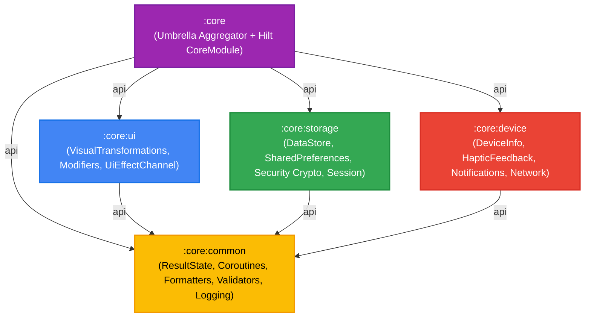

# CoreAndroidNative 🚀

[](https://github.com/Gabriel-do-Carmo-97/CoreAndroidNative/actions)


**CoreAndroidNative** é uma biblioteca de infraestrutura corporativa nativa para Android, construída em Kotlin sob os mais altos padrões de engenharia de software móvel.

Projetada especificamente para suportar múltiplos aplicativos comerciais em escala, a biblioteca é dividida em **submódulos desacoplados e especializados**, garantindo que camadas de domínio e dados permaneçam totalmente isoladas de dependências de interface de usuário (**zero Jetpack Compose nas camadas base**).

---

## 🏛️ Arquitetura Multi-Módulo



### 📦 Submódulos Disponíveis

| Artefato | Namespace | Compose? | Descrição |
| :--- | :--- | :---: | :--- |
| **`core-common`** | `br.com.wgc.core.common` | ❌ **NÃO** | `ResultState`, `CoroutineDispatchers`, `retryWithBackoff`, `CoreLogger` (PII Masking), `Validators` (CPF, CNPJ, Email, Telefone, CEP), `Formatters` (Moeda, Data, unmask). |
| **`core-storage`** | `br.com.wgc.core.storage` | ❌ **NÃO** | `KeyValueDataStore`, `DataStorePreferencesCore`, `KeyValueStorage`, `SharedPreferencesCore`, `EncryptedSharedPreferencesCore`, `FileManager`, `SessionManager`. |
| **`core-device`** | `br.com.wgc.core.device` | ❌ **NÃO** | `DeviceInfo`, `HapticFeedbackHelper`, `NetworkMonitor`, `NotificationHelper`, `ContextExtensions`. |
| **`core-ui`** | `br.com.wgc.core.ui` | ✅ **SIM** | `CpfVisualTransformation`, `PhoneVisualTransformation`, `CepVisualTransformation`, `ModifierExtensions`, `UiEffectChannel`. |
| **`core-android-native`** | `br.com.wgc.core` | Transitivo | Módulo guarda-chuva agregador que expõe todos os submódulos acima e o módulo Hilt [`CoreModule`](file:///c:/Users/gcarm/Documents/GitHub/CoreAndroidNative/core/src/main/java/br/com/wgc/core/di/CoreModule.kt). |

---

## 📦 Instalação

Adicione o repositório do **GitHub Packages** no seu arquivo `settings.gradle.kts`:

```kotlin
dependencyResolutionManagement {
    repositories {
        google()
        mavenCentral()
        maven {
            name = "GitHubPackages"
            url = uri("https://maven.pkg.github.com/Gabriel-do-Carmo-97/CoreAndroidNative")
            credentials {
                username = providers.gradleProperty("gpr.user").orNull ?: System.getenv("GITHUB_ACTOR")
                password = providers.gradleProperty("gpr.key").orNull ?: System.getenv("GITHUB_TOKEN")
            }
        }
    }
}
```

### Opção A: Importação Granular (Recomendado para Arquiteturas Limpas)

No seu módulo de regras de negócio (`:domain`):
```kotlin
dependencies {
    implementation("br.com.wgc:core-common:0.0.x")
}
```

No seu módulo de persistência/rede (`:data`):
```kotlin
dependencies {
    implementation("br.com.wgc:core-storage:0.0.x")
}
```

No seu módulo de interface de usuário (`:presentation` / `:feature`):
```kotlin
dependencies {
    implementation("br.com.wgc:core-ui:0.0.x")
    implementation("br.com.wgc:core-device:0.0.x")
}
```

### Opção B: Importação Completa (Umbrella)

No módulo da sua aplicação ou projeto simples:
```kotlin
dependencies {
    implementation("br.com.wgc:core-android-native:0.0.x")
}
```

---

## ✨ Exemplos de Utilização

### 1. 🔒 Persistência e Logout Seguro (`SessionManager`)
Coordena a limpeza atômica em thread I/O de DataStore, SharedPreferences normais, SharedPreferences criptografados e cache local:

```kotlin
@Inject
lateinit var sessionManager: SessionManager

// Executa logout completo e atômico
lifecycleScope.launch {
    sessionManager.clearSession(clearCache = true)
}
```

### 2. 🛡️ Observabilidade e Mascaramento de PII (`CoreLogger`)
Log estruturado com sanitização automática de dados confidenciais (CPF, cartões de crédito e tokens):

```kotlin
@Inject
lateinit var logger: CoreLogger

// Log seguro: dados pessoais serão mascarados automaticamente
logger.d("AUTH", "Login efetuado para CPF 123.456.789-00 com token Bearer secret_token")
// Saída no logcat: "Login efetuado para CPF ***.***.***-** com token Bearer [MASKED_TOKEN]"
```

### 3. 🎨 Máscaras em Tempo Real no Jetpack Compose (`VisualTransformation`)
Formatação automática do cursor em campos de texto sem alterar os dados puros do estado:

```kotlin
var cpfInput by remember { mutableStateOf("") }

OutlinedTextField(
    value = cpfInput,
    onValueChange = { if (it.length <= 11) cpfInput = it.unmask() },
    label = { Text("CPF") },
    visualTransformation = CpfVisualTransformation(),
    isError = !cpfInput.isValidCpf()
)
```

### 4. 📳 Feedback Tátil Resiliente (`HapticFeedbackHelper`)
Suporte a vibrações táteis padronizadas com compatibilidade nativa com Android 12+ (`VibratorManager`) e fallback silencioso:

```kotlin
@Inject
lateinit var hapticHelper: HapticFeedbackHelper

hapticHelper.vibrateClick()   // Toque sutil
hapticHelper.vibrateSuccess() // Pulso duplo indicando sucesso
hapticHelper.vibrateError()   // Pulso firme de erro/bloqueio
```

### 5. 🌐 Monitoramento Reativo de Conectividade (`NetworkMonitor`)
Monitora o estado de conexão com a internet via `StateFlow`:

```kotlin
@Inject
lateinit var networkMonitor: NetworkMonitor

networkMonitor.isConnected.collect { isOnline ->
    if (!isOnline) {
        showNoInternetBanner()
    }
}
```

### 6. 🔁 Concorrência Resiliente (`retryWithBackoff`)
Retentativas com recuo exponencial para operações de rede transitórias:

```kotlin
val userProfile = retryWithBackoff(times = 3, initialDelayMs = 1000L) {
    apiService.fetchUserProfile()
}
```

---

## 🛡️ Gates de Qualidade e Governança

O repositório é protegido por verificações estritas em cada Pull Request e push na branch `master`:

- **Detekt:** Análise estática profunda garantindo 0 advertências e 0 erros (`./gradlew detekt`).
- **Android Lint:** Regras de boas práticas e compatibilidade do SDK Android (`./gradlew lintDebug`).
- **Testes Unitários:** Cobertura automatizada com JaCoCo (`./gradlew testDebugUnitTest`).
- **Dependabot:** Monitoramento contínuo e atualização segura de dependências.

---

## 📄 Licença

Distribuído sob a licença **Apache 2.0**. Consulte `LICENSE` para mais detalhes.
